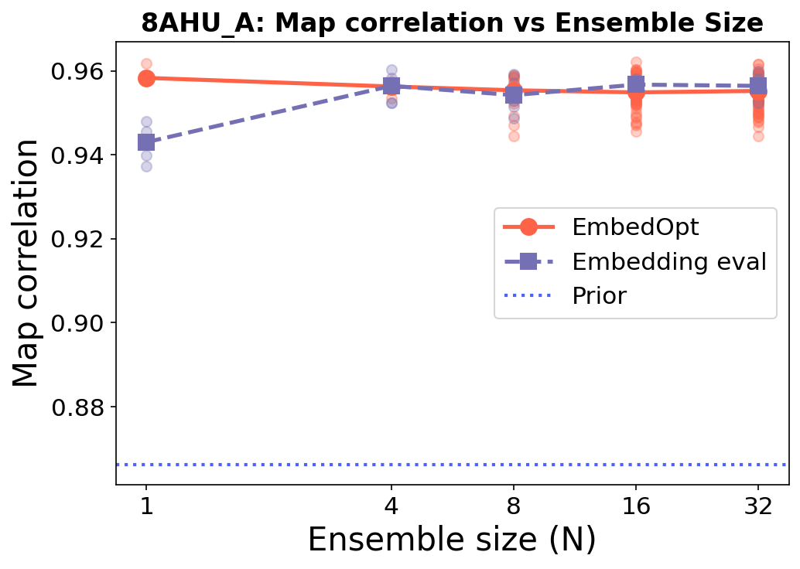
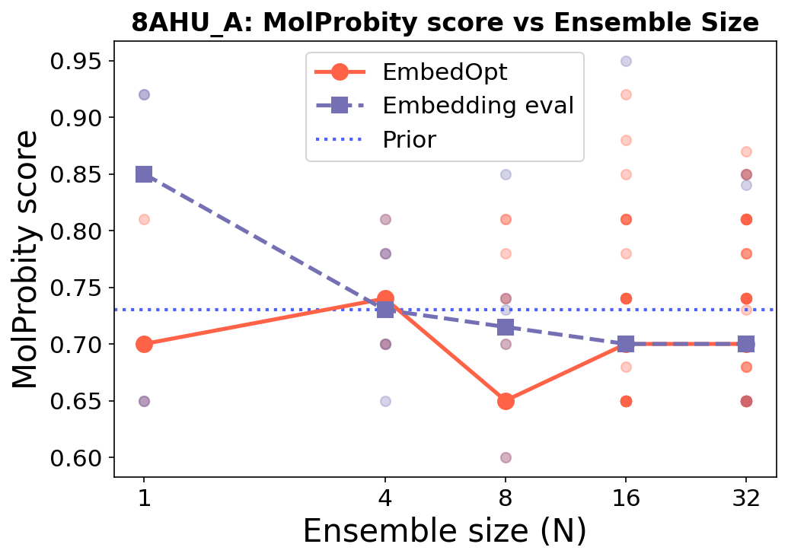
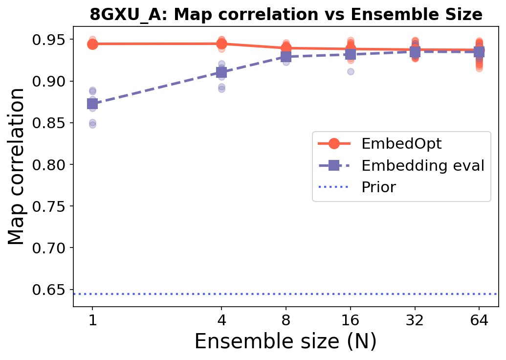
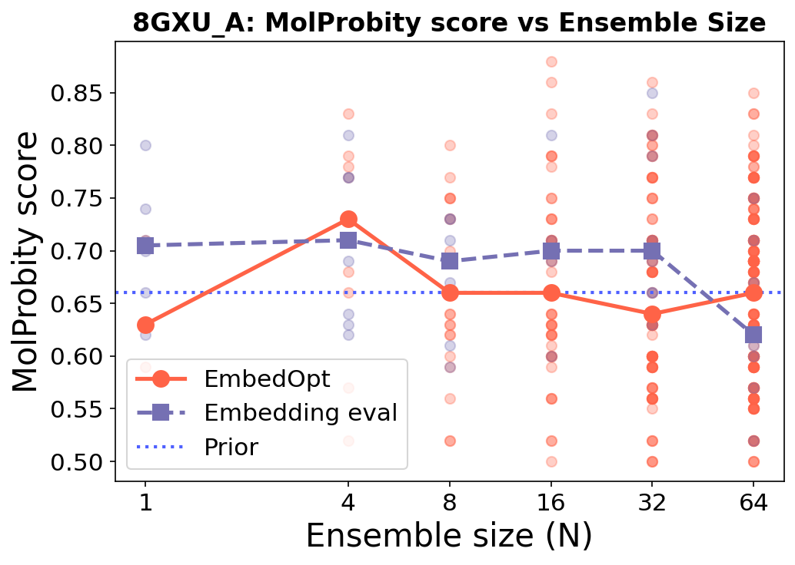
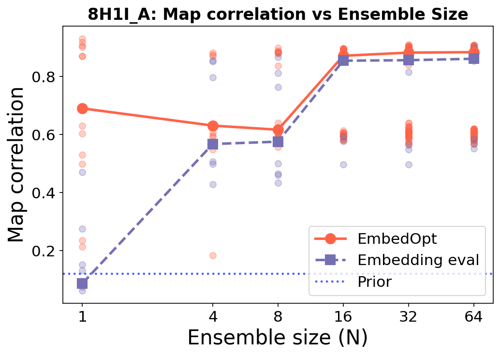
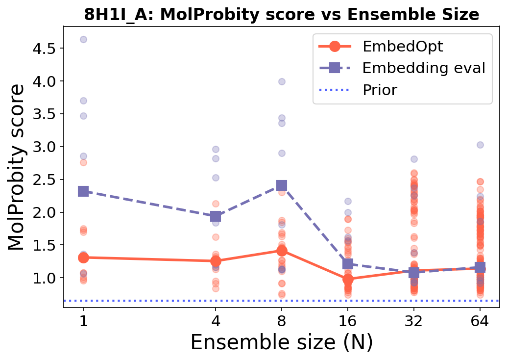
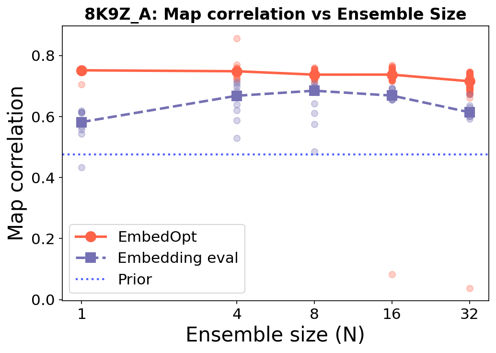
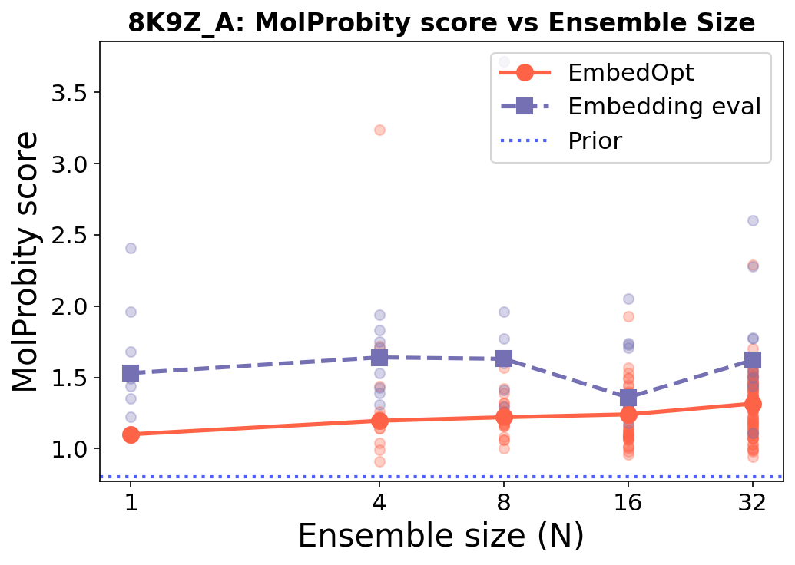
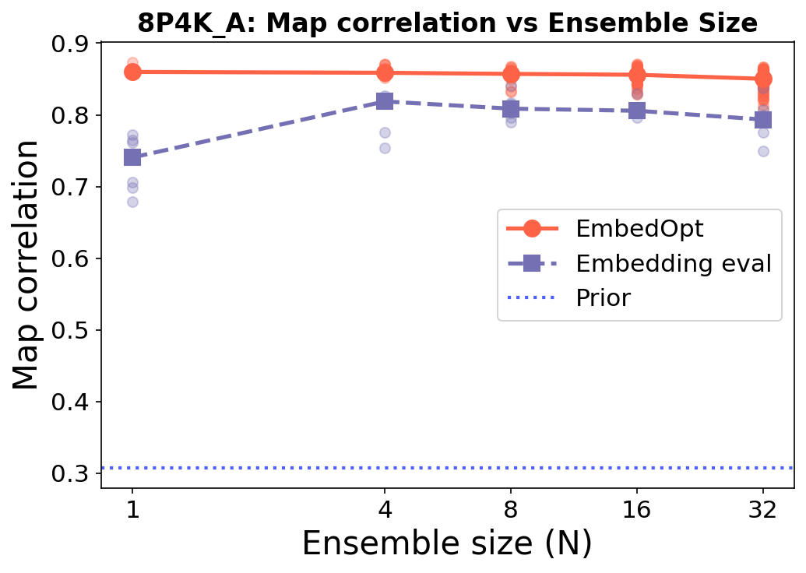
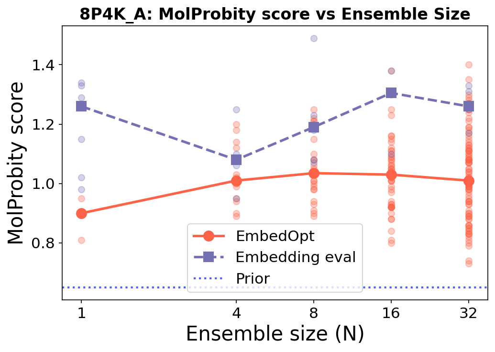

# Eval Embedding Study

Comparison of **EmbedOpt** vs **Embedding eval** vs **Prior** across ensemble sizes (N = 1, 2, 4, 8, 16, 32) on 5 targets, evaluated with two metrics after relaxation:

- **Map correlation (cc)**: measures agreement with the experimental density map (higher is better)
- **MolProbity score (mp)**: measures stereochemical quality (lower is better)

## Results

### 8AHU_A

| Map Correlation | MolProbity Score |
| --------------- | ---------------- |
|  |  |

### 8GXU_A

| Map Correlation | MolProbity Score |
| --------------- | ---------------- |
|  |  |

### 8H1I_A

| Map Correlation | MolProbity Score |
| --------------- | ---------------- |
|  |  |

### 8K9Z_A

| Map Correlation | MolProbity Score |
| --------------- | ---------------- |
|  |  |

### 8P4K_A

| Map Correlation | MolProbity Score |
| --------------- | ---------------- |
|  |  |

