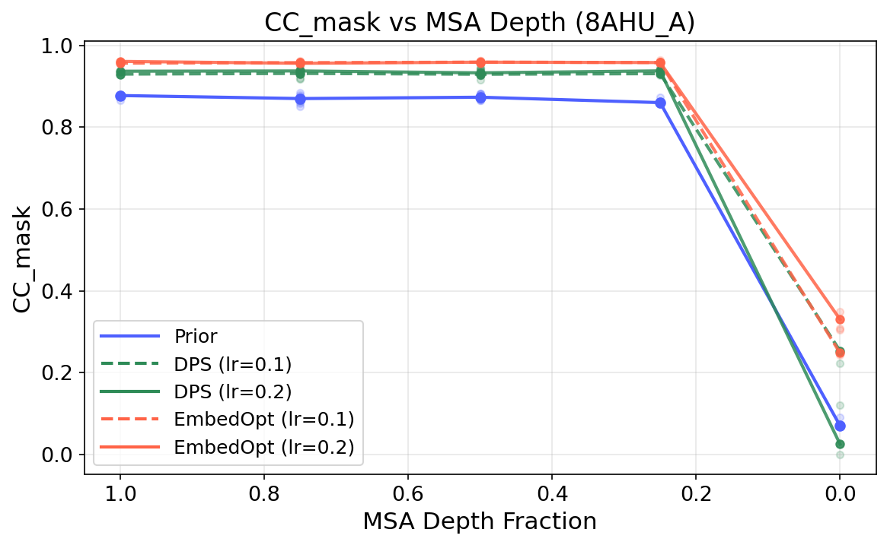
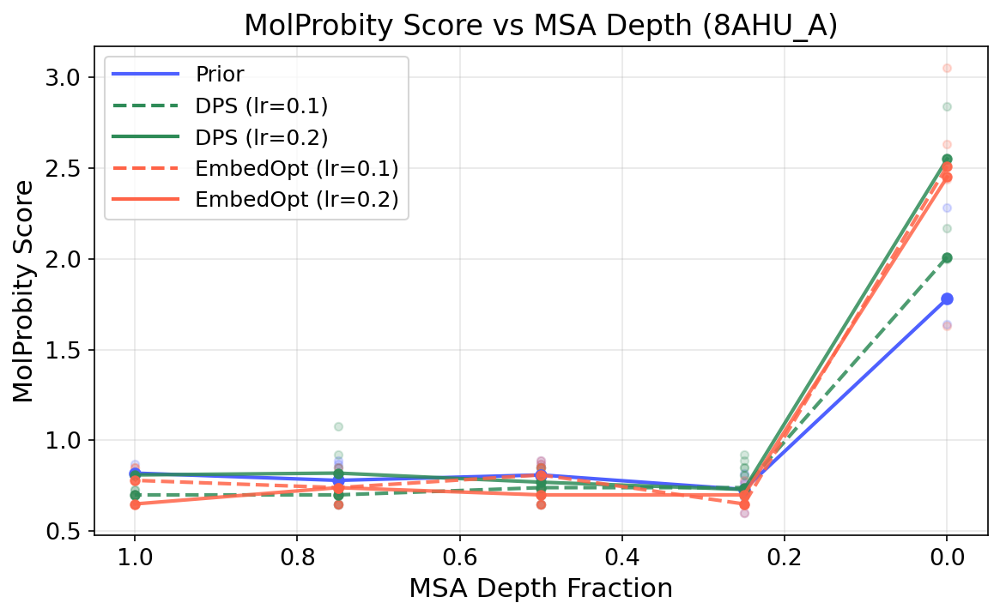
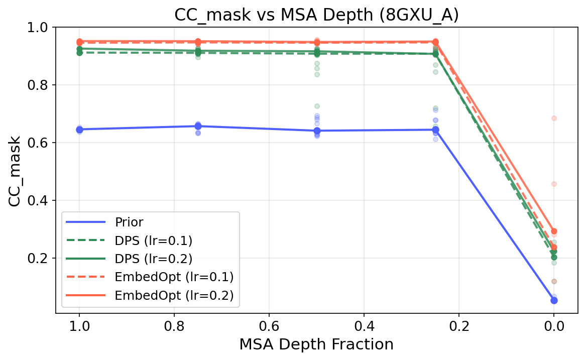
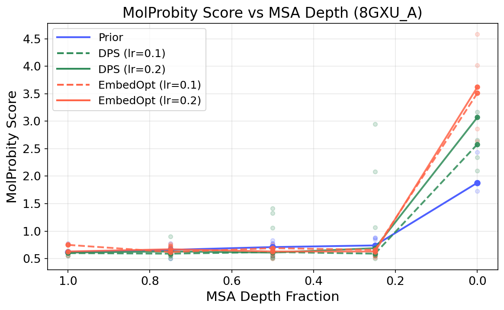
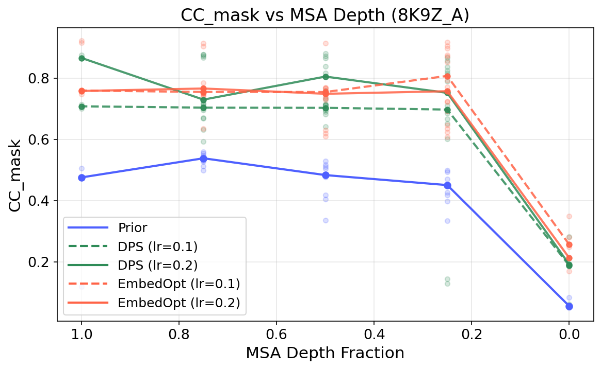
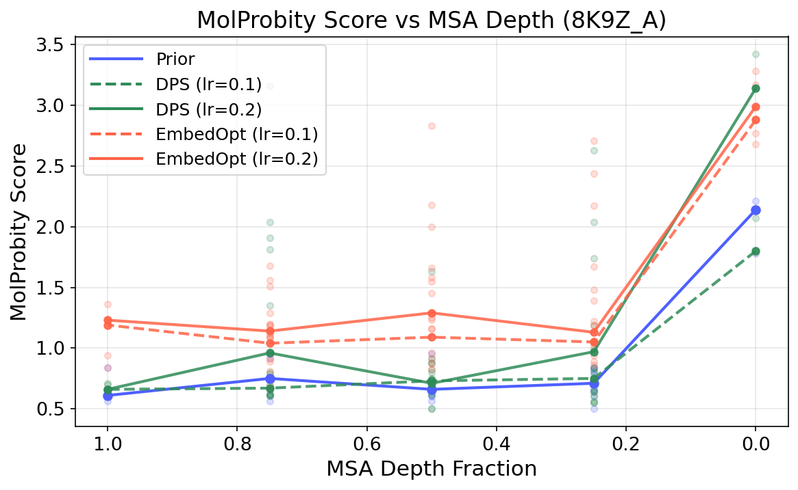

# MSA Depth Ablation Study

Ablation over **MSA depth fraction** (1.0, 0.8, 0.6, 0.4, 0.2, 0) comparing **Prior**, **DPS** (lr=0.1, 0.2), and **EmbedOpt** (lr=0.1, 0.2) on 3 targets, evaluated with two metrics after relaxation:

- **CC_mask**: map-model correlation within the mask (higher is better)
- **MolProbity score**: stereochemical quality (lower is better)

## Results

### 8AHU_A

| CC_mask | MolProbity Score |
| --- | --- |
|  |  |

### 8GXU_A

| CC_mask | MolProbity Score |
| --- | --- |
|  |  |

### 8K9Z_A

| CC_mask | MolProbity Score |
| --- | --- |
|  |  |
